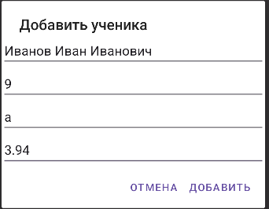

# Практическая работа №4. Работа с встроенной базой данных SQLite
#### Цель работы: Изучить основы работы с СУБД SQLite в Android-приложениях. Научиться создавать базу данных, таблицы, выполнять основные операции CRUD (Create, Read, Update, Delete) с использованием класса SQLiteOpenHelper и отображать данные на экране

Выполнил ИНС-б-о-24-1, Пузанов Александр Александрович

### Ход выполнения практической работы:
#### 1. Работа с базой данных:
Добавление студента:


Список студентов:


### Ход выполнения задания для самостоятельного выполнения (вариант 2, Школа):
#### 2. Структура таблицы:
_id - INTEGER PRIMARY KEY AUTOINCREMENT
name - TEXT
grade - INTEGER (номер класса, например 10)
letter - TEXT (буква класса, например "А")
average - REAL (средний балл)
#### 3. Класс SQLHelper:
```java
package com.example.sqlitelab;

import android.content.ContentValues;
import android.content.Context;
import android.database.Cursor;
import android.database.sqlite.SQLiteDatabase;
import android.database.sqlite.SQLiteOpenHelper;

import java.util.ArrayList;

public class SQLHelper extends SQLiteOpenHelper {

    public static final String DATABASE_NAME = "school.db";
    public static final int DATABASE_VERSION = 1;
    public static final String TABLE_NAME = "students";

    public static final String COLUMN_ID = "_id";
    public static final String COLUMN_NAME = "name";
    public static final String COLUMN_GRADE = "grade";
    public static final String COLUMN_LETTER = "letter";
    public static final String COLUMN_AVERAGE = "average";

    private static final String CREATE_TABLE = "CREATE TABLE " + TABLE_NAME + " ("
            + COLUMN_ID + " INTEGER PRIMARY KEY AUTOINCREMENT, "
            + COLUMN_NAME + " TEXT NOT NULL, "
            + COLUMN_GRADE + " INTEGER, "
            + COLUMN_LETTER + " TEXT, "
            + COLUMN_AVERAGE + " REAL);";

    public SQLHelper(Context context) {
        super(context, DATABASE_NAME, null, DATABASE_VERSION);
    }

    @Override
    public void onCreate(SQLiteDatabase db) {
        db.execSQL(CREATE_TABLE);
    }

    @Override
    public void onUpgrade(SQLiteDatabase db, int oldVersion, int newVersion) {
        db.execSQL("DROP TABLE IF EXISTS " + TABLE_NAME);
        onCreate(db);
    }

    public long addStudent(String name, int grade, String letter, double average) {
        SQLiteDatabase db = this.getWritableDatabase();
        ContentValues values = new ContentValues();
        values.put(COLUMN_NAME, name);
        values.put(COLUMN_GRADE, grade);
        values.put(COLUMN_LETTER, letter);
        values.put(COLUMN_AVERAGE, average);

        long id = db.insert(TABLE_NAME, null, values);
        db.close();
        return id;
    }

    public ArrayList<Student> getAllStudents() {
        ArrayList<Student> list = new ArrayList<>();
        SQLiteDatabase db = this.getReadableDatabase();

        Cursor cursor = db.rawQuery("SELECT * FROM " + TABLE_NAME, null);

        if (cursor.moveToFirst()) {
            do {
                int id = cursor.getInt(cursor.getColumnIndexOrThrow(COLUMN_ID));
                String name = cursor.getString(cursor.getColumnIndexOrThrow(COLUMN_NAME));
                int grade = cursor.getInt(cursor.getColumnIndexOrThrow(COLUMN_GRADE));
                String letter = cursor.getString(cursor.getColumnIndexOrThrow(COLUMN_LETTER));
                double avg = cursor.getDouble(cursor.getColumnIndexOrThrow(COLUMN_AVERAGE));

                list.add(new Student(id, name, grade, letter, avg));
            } while (cursor.moveToNext());
        }

        cursor.close();
        db.close();
        return list;
    }

    public int updateStudent(Student student) {
        SQLiteDatabase db = this.getWritableDatabase();

        ContentValues values = new ContentValues();
        values.put(COLUMN_NAME, student.getName());
        values.put(COLUMN_GRADE, student.getGrade());
        values.put(COLUMN_LETTER, student.getLetter());
        values.put(COLUMN_AVERAGE, student.getAverage());

        return db.update(TABLE_NAME, values,
                COLUMN_ID + "=?",
                new String[]{String.valueOf(student.getId())});
    }

    public void deleteStudent(int id) {
        SQLiteDatabase db = this.getWritableDatabase();
        db.delete(TABLE_NAME, COLUMN_ID + "=?",
                new String[]{String.valueOf(id)});
        db.close();
    }
}
```
#### 4. Модель данных:
```java
package com.example.sqlitelab;

public class Student {

    private int id;
    private String name;
    private int grade;
    private String letter;
    private double average;

    public Student(int id, String name, int grade, String letter, double average) {
        this.id = id;
        this.name = name;
        this.grade = grade;
        this.letter = letter;
        this.average = average;
    }

    public int getId() {
        return id;
    }

    public String getName() {
        return name;
    }

    public int getGrade() {
        return grade;
    }

    public String getLetter() {
        return letter;
    }

    public double getAverage() {
        return average;
    }

    public void setName(String name) {
        this.name = name;
    }

    public void setGrade(int grade) {
        this.grade = grade;
    }

    public void setLetter(String letter) {
        this.letter = letter;
    }

    public void setAverage(double average) {
        this.average = average;
    }
}
```
#### 5. MainActivity:
```java
package com.example.sqlitelab;

import android.app.AlertDialog;
import android.os.Bundle;
import android.view.View;
import android.widget.*;
import androidx.appcompat.app.AppCompatActivity;

import java.util.ArrayList;

public class MainActivity extends AppCompatActivity {

    private SQLHelper dbHelper;
    private LinearLayout container;

    @Override
    protected void onCreate(Bundle savedInstanceState) {
        super.onCreate(savedInstanceState);
        setContentView(R.layout.activity_main);

        dbHelper = new SQLHelper(this);
        container = findViewById(R.id.container);

        Button btnAdd = findViewById(R.id.btnAdd);
        Button btnShow = findViewById(R.id.btnShow);

        btnAdd.setOnClickListener(v -> showAddDialog());
        btnShow.setOnClickListener(v -> displayAllStudents());
    }

    private void showAddDialog() {
        LinearLayout layout = new LinearLayout(this);
        layout.setOrientation(LinearLayout.VERTICAL);

        EditText etName = new EditText(this);
        etName.setHint("ФИО");

        EditText etGrade = new EditText(this);
        etGrade.setHint("Класс (число)");

        EditText etLetter = new EditText(this);
        etLetter.setHint("Буква");

        EditText etAvg = new EditText(this);
        etAvg.setHint("Средний балл");

        layout.addView(etName);
        layout.addView(etGrade);
        layout.addView(etLetter);
        layout.addView(etAvg);

        new AlertDialog.Builder(this)
                .setTitle("Добавить ученика")
                .setView(layout)
                .setPositiveButton("Добавить", (dialog, which) -> {
                    String name = etName.getText().toString();
                    int grade = Integer.parseInt(etGrade.getText().toString());
                    String letter = etLetter.getText().toString();
                    double avg = Double.parseDouble(etAvg.getText().toString());

                    dbHelper.addStudent(name, grade, letter, avg);
                    displayAllStudents();
                })
                .setNegativeButton("Отмена", null)
                .show();
    }

    private void displayAllStudents() {
        ArrayList<Student> list = dbHelper.getAllStudents();
        container.removeAllViews();

        for (Student s : list) {
            TextView tv = new TextView(this);
            tv.setText(s.getId() + ": " + s.getName() + ", "
                    + s.getGrade() + s.getLetter()
                    + ", ср. балл: " + s.getAverage());
            tv.setTextSize(16);
            tv.setPadding(8, 8, 8, 8);

            tv.setOnLongClickListener(v -> {
                dbHelper.deleteStudent(s.getId());
                displayAllStudents();
                return true;
            });

            tv.setOnClickListener(v -> showEditDialog(s));

            container.addView(tv);
        }
    }

    private void showEditDialog(Student student) {
        LinearLayout layout = new LinearLayout(this);
        layout.setOrientation(LinearLayout.VERTICAL);

        EditText etName = new EditText(this);
        etName.setText(student.getName());

        EditText etGrade = new EditText(this);
        etGrade.setText(String.valueOf(student.getGrade()));

        EditText etLetter = new EditText(this);
        etLetter.setText(student.getLetter());

        EditText etAvg = new EditText(this);
        etAvg.setText(String.valueOf(student.getAverage()));

        layout.addView(etName);
        layout.addView(etGrade);
        layout.addView(etLetter);
        layout.addView(etAvg);

        new AlertDialog.Builder(this)
                .setTitle("Редактировать")
                .setView(layout)
                .setPositiveButton("Сохранить", (dialog, which) -> {

                    student.setName(etName.getText().toString());
                    student.setGrade(Integer.parseInt(etGrade.getText().toString()));
                    student.setLetter(etLetter.getText().toString());
                    student.setAverage(Double.parseDouble(etAvg.getText().toString()));

                    dbHelper.updateStudent(student);
                    displayAllStudents();
                })
                .setNegativeButton("Отмена", null)
                .show();
    }
}
```
#### 6. Результат:
Диалоговое окно:


Заполненная карточка:



Список:


### Контрольные вопросы:
1. Какие типы данных поддерживает SQLite? Как в SQLite можно хранить логические значения и даты?
типы: NULL, INTEGER, REAL, TEXT, BLOB
Логические значения: как INTEGER (0 - false, 1 - true)
Даты:
- TEXT ("YYYY-MM-DD")
- INTEGER (timestamp)
- REAL (юлианская дата)
2. Для чего нужен класс SQLiteOpenHelper? Опишите назначение методов onCreate() и onUpgrade().
Нужен для управления БД (создание и обновление)
- onCreate() - вызывается при первом создании БД, создаёт таблицы
- onUpgrade() - вызывается при изменении версии БД, обновляет структуру
3. В чем разница между методами getWritableDatabase() и getReadableDatabase()? В каких ситуациях может возникнуть ошибка при вызове getWritableDatabase()?
getWritableDatabase() - чтение и запись
getReadableDatabase() - только чтение
Ошибка у getWritableDatabase() может быть:
- нет места на устройстве
- нет прав доступа
4. Что такое Cursor? Как правильно перемещаться по его элементам и почему важно закрывать его после использования?
Cursor — это интерфейс, предоставляющий произвольный доступ к результирующему набору запроса. Он позволяет перемещаться по строкам и читать значения столбцов. Важно не забывать закрывать Cursor после использования вызовом close().
5. Что такое ContentValues и для каких операций он применяется?
ContentValues — это контейнер для пар "ключ-значение", где ключ — имя столбца, а значение — данные для вставки или обновления
Используется в: insert() и update()
6. В чем отличие методов query() и rawQuery()? Приведите пример использования rawQuery() с параметром-плейсхолдером (?).
query() - без SQL вручную
rawQuery() - SQL вручную
пример:
Cursor cursor = db.rawQuery(
    "SELECT * FROM students WHERE grade = ?",
    new String[]{"10"}
);
7. Как обработать ситуацию, когда таблица уже существует, но её структура была изменена (например, добавлено новое поле)?
Используется onUpgrade():
Варианты:
- удалить и создать заново:
db.execSQL("DROP TABLE IF EXISTS students");
onCreate(db);
- или добавить поле:
db.execSQL("ALTER TABLE students ADD COLUMN new_column TEXT");